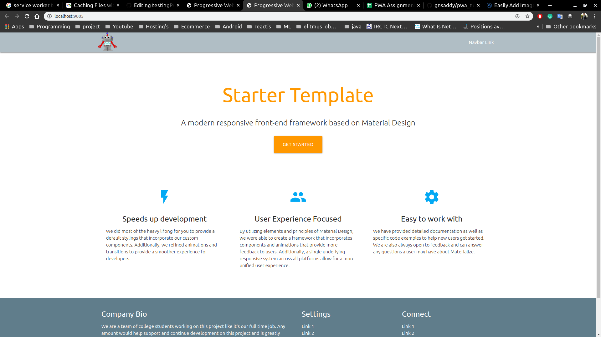

# Progressive Web App with express server, nodejs application with docker Conatiner

```ProgressiveWebApp

Progressive Web App using vanilla js, HTML, bootstrap, css.

Implementation of Progressive Web App

Name - Aditya Raj

```


# Installation


```javascript

    // then install the npm modules using
     
    npm install


```


# Running the application


```javascript


    node server.js
To check running port:-
    $ sudo lsof -i -P -n
kill running port:-
    $ fuser -k PORT-NUMBER/tcp
    


```


# Docker Installation
```
Step 1 — Installing Docker
First, update your existing list of packages:
    $ sudo apt update
Next, install a few prerequisite packages which let apt use packages over HTTPS:
    $ sudo apt install apt-transport-https ca-certificates curl software-properties-common
Then add the GPG key for the official Docker repository to your system:
    $ curl -fsSL https://download.docker.com/linux/ubuntu/gpg | sudo apt-key add -
Add the Docker repository to APT sources:
    $ sudo add-apt-repository "deb [arch=amd64] https://download.docker.com/linux/ubuntu bionic stable"
Next, update the package database with the Docker packages from the newly added repo:
    $ sudo apt update
Make sure you are about to install from the Docker repo instead of the default Ubuntu repo:
    $ apt-cache policy docker-ce
Finally install docker
    $ sudo apt install docker-ce
Docker should now be installed, the daemon started, and the process enabled to start on boot. Check that it’s running:
    $ sudo systemctl status docker

```

```
Step 2 — Executing the Docker Command Without Sudo
If you want to avoid typing sudo whenever you run the docker command, add your username to the docker group:
    $ sudo usermod -aG docker ${USER}
If you want to avoid typing sudo whenever you run the docker command, add your username to the docker group:

    $ sudo usermod -aG docker ${USER}
To apply the new group membership, you can log out of the server and back in, or you can type the following:

    $ su - ${USER}
You will be prompted to enter your user’s password to continue. Afterwards, you can confirm that your user is now added to the docker group by typing:

    $ id -nG

```

# docker-compose

```
>>>>To install docker compose for the steps
$ sudo curl -L "https://github.com/docker/compose/releases/download/1.24.0/docker-compose-$(uname -s)-$(uname -m)" -o /usr/local/bin/docker-compose
$ sudo chmod +x /usr/local/bin/docker-compose

OR
 
$ apt-get install docker-compose


>>>>to check the versions of the docker and docker-compose
    $ docker --version
    $ docker-compose --version


>>>>first start the docker service by using command
    $ service docker start

```

# Building docker image

```bash

    docker build -t <imagename:version> .
    example :-  docker build -t testing_pwa_node:latest

```

# Running docker container


```bash

    // 9005 port is given since the docker file contains 9005 port
    docker run -it -d -p <outside-port-of-your-choice>:9005 <imagename:version>

    example: - docker run -it -d -p 5000:9005 testing_pwa_node:latest

```
# Open Chrome browser and run

```browser

    localhost:5000

```

# Zipping Docker image

```docker image
    $ docker save -o filename.tar <image-name>
Example:- 
    $ docker save -o docker_image_node.tar testing_pwa_node

```

# Load docker image
```load image
    $ docker load -i filename.tar
Example:-
    $ docker load -i testing_pwa_node.tar

```
# Docker-compose
```docker-compose
docker-compose.yml must be included:-
version: '3'
services:
  web:
    build: .
    ports:
      - "5000:5000"
  redis:
    image: "redis:alpine"
The web service uses an image that’s built from the Dockerfile in the current directory.
 It then binds the container and the host machine to the exposed port
1) First load the docker image
    $ docker load -i filename.tar
2) Check docker image is loaded or not
    $ docker images
3) docker-compose up
    $ docker-compose up

```
# Docker deletion commands
```docker delete
1) Remove docker images
The docker system prune command will remove all stopped containers,
 all dangling images, and all unused networks:
    $ docker system prune
You’ll be prompted to continue, use the -f or --force flag to bypass the prompt.
Output-
WARNING! This will remove:
        - all stopped containers
        - all networks not used by at least one container
        - all dangling images
        - all build cache
Are you sure you want to continue? [y/N]

2) Removing Docker Containers
You can get a list of all containers by passing the -a flag to the docker container ls command:
    $ docker container ls -a
Once you know the CONTAINER ID of the containers you want to delete,
pass it to the docker container rm command. For example, to remove the first two containers listed in the output above run:
    $ docker container rm cc3f2ff51cab cd20b396a061
3) Remove all stopped containers
Before performing the removal command, you can get a list of all non-running (stopped) 
containers that will be removed using the following command:
    $ docker container ls -a --filter status=exited --filter status=created 
4) Remove one or more images
    $ docker image ls
    $ docker rmi <IMAGE ID>
Forcefully
    $ docker rmi -f <IMAGE ID>

```


# docker important commands

```
    $ docker --version
    $ docker images
To check running docker images
    $ docker ps
To stop a running process
    $ docker stop <docker-image-name>
To build a docker image
    $ docker build -t <image-name>
NOTE - Must contain Dockerfile

```

# Topic Covered :-

```Topics

1. Introduction to Progressive Web App
2. Accelerated Mobile Pages
3. AMP vs PWA vs Native Apps
4. PWA Advantages
5. What exactly the service worker is?
6. Working of service worker
7. Web Manifest file
8. Creation of mainifest file
9. Working with the JSON
10. DOM and service worker thread
11. Life cycle of service worker
12. Javascript Promise
13. navigator object
14. Chrome dev tools
15. Audit with lighthouse tool
16. Web app to device home screen
17. service worker fetch event
18. Pre-caching and shell model approch
19. Getting caching assets

```

# Tools and technology used:
``` 
1. HTML5
2. CSS3
3. vanilla Javascript
4. Http server
5. VS code
6. Git
7. Github
8. Express server
9. Nodejs and npm
10.Docker Container
11.Service Worker
12.Manifest
13.Android SDK

```
# Screenshots




----------------------------------------------------------------------


----------------------------------------------------------------------


----------------------------------------------------------------------


---------------------------------------------------------------------


---------------------------------------------------------------------


